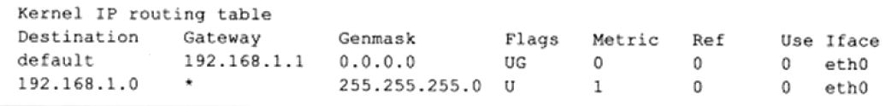
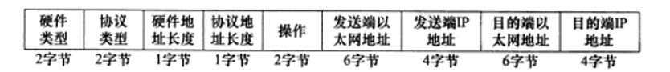

---

title: TCP/IP全总结

---

 马上要有一大波面试了，所以趁着还有时间把面试需要的几块知识做一个完整的总结，主要分为以下几个部分：TCP/IP,操作系统，C++基础，数据库基础。本博为第一部分，关于TCP/IP的总结。

##(一) TCP/IP协议基础
TCP/IP不是一个协议，而是一个协议族的统称。里面包含了几个分层的协议，比如网络层的IP协议，传输层的TCP、UDP协议、应用层的http、ftp等协议。
首先就要明白TCP/IP协议族的分层，提到分层，我们很容易想到的是OSI七层协议经典架构，为了方便记忆，也可以进行口诀记忆，“物数网传会表应”，但是TCP/IP的分层稍有不同，只分为四层，从上到下依次为应用层、传输层、网络层、数据链路层。简单介绍一下各层，最上面的应用层，里面有http、ftp等协议，再往下为传输层，里面主要有tcp、udp协议，第三层为网络层，IP协议就在这一层，它负责对数据加上IP地址及其它数据以确定发送的目标，最底层为数据链路层，这个层次的定义包括了网线的制式，网卡的定义等；发送协议的主机将数据逐层往下层层封装，而接受数据的主机则按照协议从得到的数据包解开，最终拿到需要的数据。
> 一些基本的常识：
+ 互联网IP地址：网络上每个设备节点都必须有一个独立的IP地址，现在通用的IP地址是一个32bit的数字，也就是IPV4标准，将32bit的数字分成4组，也就是常见的255.255.255.255的样式。IPV4标准下，地址被分为五类，我们常用的是B类地址。对用到操作系统,IP地址+端口号对应操作系统的一个进程。
+ 域名系统：域名系统是一个分布式的数据库，DNS即是把域名即网址转换成IP地址的服务。

##(二) 数据链路层
数据链路层有3个目的：
 1. 为IP模块发送和接受IP数据报
 2. 为ARP模块发送ARP请求和接受ARP应答
 3. 为RARP模块发送RARP请求和接受RARP应答
 
关于ARP和RARP，ARP叫做地址解析协议，是IP地址与MAC地址转换的协议，而RARP则叫做逆地址解析协议（后面会有详细介绍）。
数据链路层还有很多其他的协议，比如我们常用的以太网帧协议，也有不太常见的令牌环,还有FDDI，国内常见的PPP协议(ADSL宽带)，还有loopback协议等。

由于cmd markdown编辑器贴图还要会员功能，所以我把ifconfig的结果，复制成文字如下所示：
>1.eth0 Link encap:Ethernet HWaddr 00:01:4A:03:5B:ED
2.inet addr:192.168.11.2 Bcast:192.168.11.255 Mask:255.255.255.0
3.inet6 addr: fe80::201:4aff:fe03:5bed/64 Scope:Link
4.UP BROADCAST RUNNING MULTICAST MTU:1500 Metric:1
5.RX packets:2819 errors:0 dropped:0 overruns:0 frame:0
6.TX packets:76 errors:0 dropped:0 overruns:0 carrier:0
7.collisions:0 txqueuelen:1000
8.RX bytes:241609 (235.9 KiB) TX bytes:9596 (9.3 KiB)
9.lo Link encap:Local Loopback
10.inet addr:127.0.0.1 Mask:255.0.0.0
11.inet6 addr: ::1/128 Scope:Host
12.UP LOOPBACK RUNNING MTU:16436 Metric:1
13.RX packets:2713 errors:0 dropped:0 overruns:0 frame:0
14.TX packets:2713 errors:0 dropped:0 overruns:0 carrier:0
15.collisions:0 txqueuelen:0
16.RX bytes:3516032 (3.3 MiB) TX bytes:3516032 (3.3 MiB)

其中,第一行eth0（如果一台PC上有多个网卡，则会有多个），后面是mac地址（对应网卡）；第二行网络的ip、子网、掩码（后面会有介绍）；第三行表示对应IPv6地址；第四行表示状态，UP表示网卡已经启用，BROADCAST表示支持广播，RUNNING表示网卡正在运行，后面依次为支持多播、最大传输单元、度量值（用于估算路由）；第五行依次表示接受的正确数据包数、错误数据报数、丢弃的数据包数；第六行同第五行；第八行表示接受和发送的字节数；第十行表示主机的回环地址（这个一般是用来测试一个网络程序，但又不想让局域网或外网的用户能够查看，只能在此台主机上运行和查看所用的网络接口）；

每一种数据链路层协议都有MTU（最大传输单元）的限制，在这个定义下，如果IP数据报过大，就要进行分片，使得每片都小于MTU；可以用netstat -in打印出MTU的结果；下图中上面为以太网，下面为loopback
>Kernel Interface table
Iface MTU Met RX-OK RX-ERR RX-DRP RX-OV TX-OK TX-ERR TX-DRP TX-OVR 
eth0  1500 0  1774  0      0      0      587      0      0      0 
lo  16436  0  2667  0      0      0     2667      0      0      0 

##(三) IP协议、ARP协议、RARP协议
在网络层，我们主要讲这三个协议，ARP协议主要用来找到目标主机的以太网MAC地址；RARP主要用来通过MAC地址确认IP地址；IP主要用来传载消息；对于数据链路层与网络层之间的关系，数据链路层通过ARP来获得数据的传达信息，通过IP来获得要传输的数据信息。
>IP协议

 - 简介
IP协议以数据报形式进行传输，为上层提供无状态、无连接、不可靠的服务。无连接表示的是IP通信双方都不需要长时间保持连接状态，只需要在传输时，确定目标IP地址；无状态表示的是双方不同步传输数据的状态，每一个IP数据报都是相互独立的，有可能出现重复或者顺序颠倒等，接收端只要接收到完整的IP数据报（如果有分片就先充足），就将数据报交给上层协议，在上层协议看来，这些数据报就是乱的，如果是面向连接的上层协议，如TCP，就能够自己处理这些乱序的数据报，保证传输到应用层的是有序、可靠的数据；不可靠是指IP数据报不保证一定能够达到目的地，很多情况都会导致IP数据报发送失败。
 - IP协议头部
IP协议包含至少20字节的头部信息，分为1-4字节（4位版本号、4位首部长度、8位服务类型，16位总长度）；5-8字节（16位标识，3位标志，13位片偏移（分片相对原始IP数据报的偏移））；9-12字节（8位生存时间（从源主机到达目标主机经过的路由跳数上限）、8位协议（用于区分上层协议）、16位首部检验和）；13-16（源IP地址）；17-20（目的IP地址）。
 - IP分片
 前面提到了，当IP数据报的长度超过以太网帧的MTU时，就会分片传输，分片可能发生在IP数据报传输的任意过程中，包括发送端、中转路由、目标主机等，但只有在目标主机上，才回将分片的IP数据报进行重组。
IP协议头的5-8字节为分片和重组提供了足够的信息，如果发生了分片，那么来自同一IP数据报的分片都有相同的16位标识，但他们的13位片偏移不同，并且除了最后一片分片，其余分片都设置MF标志。
 - IP路由
IP协议的一个核心任务是数据报的路由，即决定发送数据报到目标主机的路径。可参考linux高性能服务器编程图2-3，当主机接收到对方的以太网帧时，去掉以太网帧头帧尾，得到IP数据报，首先对该数据报的头部做CRC校验，确认无误之后开始分析IP数据报头部信息。如果IP数据报头部设置了源站选路选项，则IP模块调用数据报转发子模块处理该数据报。如果该IP数据报的头部目标IP地址是本机的某个IP地址，或者是广播地址，那么该数据报就是发给本机的，则IP模块就根据9-12字节的8位协议决定分发给哪个上层应用。如果IP模块发现这个数据报不是发送给本机的，那么就调用数据报转发子模块处理该数据报。（需要检测是否允许转发，IP头部中有该部分信息）。
数据转发发至哪一跳路由（或者目标机器），以及经过哪个网卡来发送就是IP路由过程。IP模块实现数据报路由的核心数据转发的结构就是路由表。这个表按照数据报的目标IP地址分类，同一类型的IP数据报将被发往相同的下一跳路由。可以通过route命令看到路由表信息。如下图：

图中依次为目标地址，网关地址，网络掩码，路由项标志，路由距离，最后一项为路由项对应的输出网卡接口。（图中*表示目标和本机在同一个网络中，不需要进行IP路由）
每个主机都维护一个路由表，首先，检测TTL，路由中转跳数是否已到，当接收到的IP数据报目标IP地址与路由表中Destination相符时，表明该IP数据报是可以直接发送给目标机器的，不需要经过路由；如果没有相符，那么匹配子网的路由器(子网掩码)；如果没有相符，那么匹配同网号的路由器；如果都失败了，那么搜索默认路由，需要通过网关来转发（网关：网关是具有路由功能的设备的IP地址，每个网络都有自己的网关，当两个IP不在同一个网络时，就需要通过各自的网关进行数据传输）；如果默认路由不存在，那么丢弃这个IP数据包。

>>子网寻址
IP地址是有网络号+子网号+主机号组成的，比如一个B类IP地址：210.30.109.134,  210.30就是网络号；109就是子网号；134表示主机号；子网掩码中的1对应原IP地址中的网络号加上子网号，0对应主机号；子网掩码与IP地址进行逐位“与”运算，就可以得出网络地址。
> >路由表更新
>>>手动设置（静态更新）
在ernest-laptop的linux下，
sudo route add -host 192.168.1.109 dev eth0
sudo route del -net 192.168.1.0 netmask 255.255.255.0
sudo route del default
sudo route add default gw 192.168.1.109 dev eth0
第一行表示添加192.168.1.109对应的路由项，这样所有从ernest-laptop发送到Kongming20的IP数据报将通过网卡eth0直接发送至目标机器的接受网卡；
第二行表示删除192.168.1.0对应的路由项，这样就无法发送至192.168.1.0局域网下的所有主机；
第三行表示删除default对应的路由项，这样就无法发送至广域网
第四行表示重新设置默认路由项，不过这次网关设置为Kongming20
>>>动态更新
对于大型的路由器，通常通过BGP、RIP、OSPF等协议来发现路径，并更新路由表。

>ARP协议
ARP协议能够实现任意网络层地址到任意物理地址的转换，不过我们在此仅仅讨论IP地址到MAC地址的转换。我们知道每个网卡对应一个MAC地址，那么IP地址数据报是如何对应到MAC的呢？以太网ARP请求、应答报文格式如下：

硬件类型表示物理层的地址类型，1表示mac地址；协议类型表示上层协议，0x080表示IP协议。
ARP协议是一种解析协议，每个主机也会维护一个IP-ARP地址对应缓存表，之前对应过的二者都会放在这个缓存表里，如果在这个缓存表中，没有查询到对应的IP地址，那么主机就向自己所在网络发送一个ARP协议包，接到这个协议包的主机都会查询自己的IP是否对应，如果对应，那么就准备好一个包含自己MAC地址的ARP包传回至发送ARP广播的主机，那么发送的主机就会更新自己的ARP协议包，发送广播的主机就会用新的ARP协议包得到对应的MAC地址来封装以太网帧。

